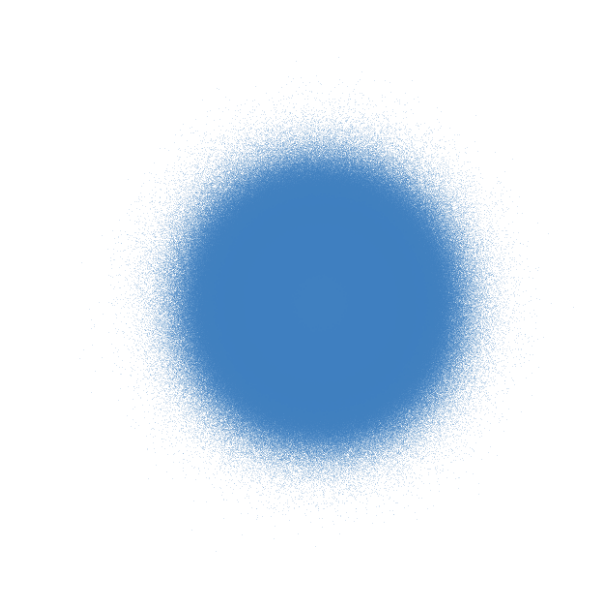
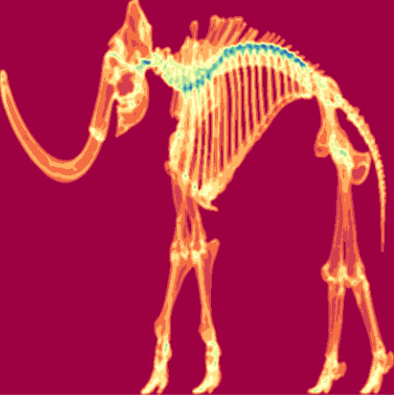
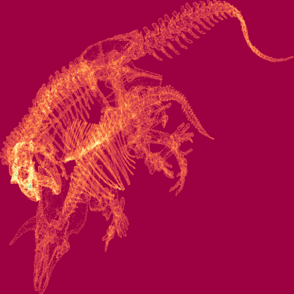

# scattermore2 🎆 

## Fast Scatterplots with More Points

[](https://github.com/Teri934/scattermore2/actions/workflows/R-CMD-check.yaml) [](https://github.com/Teri934/scattermore2/actions/workflows/pkgdown.yaml)   [](https://github.com/Teri934/scattermore2/actions/workflows/test-coverage.yaml)

### Installation 💻
```r
devtools::install_github('teri934/scattermore2')
```

### Short Description 📝
R package with implemented C-based conversion of large scatterplot data to rasters plus other operations such as data blurring or data alpha blending. Speeds up plotting of data with millions of points.


### Simple Usage 🖱️

```r
library(scattermore2)
```

#### Make Histograms...

```r
histogram <- make_histogram(cbind(rnorm(1e5), rnorm(1e5)))
colorized_histogram <- colorize_histogram(histogram)
raster <- rgba_int_to_raster(rgbwt_to_rgba_int(colorized_histogram))
plot(raster)
```

#### ... Colorize Data...
```r
colorized <- colorize_data(cbind(rnorm(1e5), rnorm(1e5)), RGBA= c(64,128,192,50))
raster <- rgba_int_to_raster(rgbwt_to_rgba_int(colorized))
plot(raster)
```

#### ... and Other Stuff
```r
blabla
```

### Really Fast ⏩

Compare `scattermore2` with default R functionality. `Scattermore2` only creates raster graphics for the plots, its result can be plotted afterwards.

```r
# create 10 million 2D datapoints
data <- cbind(rnorm(1e7),rnorm(1e7))
```
```r
# plot the datapoints and see how long it takes
system.time(plot(rgba_int_to_raster(rgbwt_to_rgba_int(colorize_data(data, RGBA= c(64,128,192,50))))))

   user  system elapsed 
  0.743   0.216   0.959 
```

You should see something like this:

<kbd></kbd>

Now the default:

```r
system.time(plot(data, pch='.', xlim=c(-5,5), ylim=c(-5,5), col=rgb(0.25,0.5,0.75,0.04)))

   user  system elapsed 
  6.944   0.060   7.012 
```

So we see other...


### Scattermore2 and Archaelogy 🦴

Nice examples for creating histograms from archaelogical data. Smithsonian Institute provides a lot of interesting data, including [mammoth skeleton](https://3d.si.edu/explorer/woolly-mammoth) 
and [T-rex skeleton eating triceratops skeleton](https://3d.si.edu/object/3d/tyrannosaurus-rex:d8c62d28-4ebc-11ea-b77f-2e728ce88125).


<kbd></kbd> &nbsp;&nbsp;&nbsp; <kbd></kbd>
