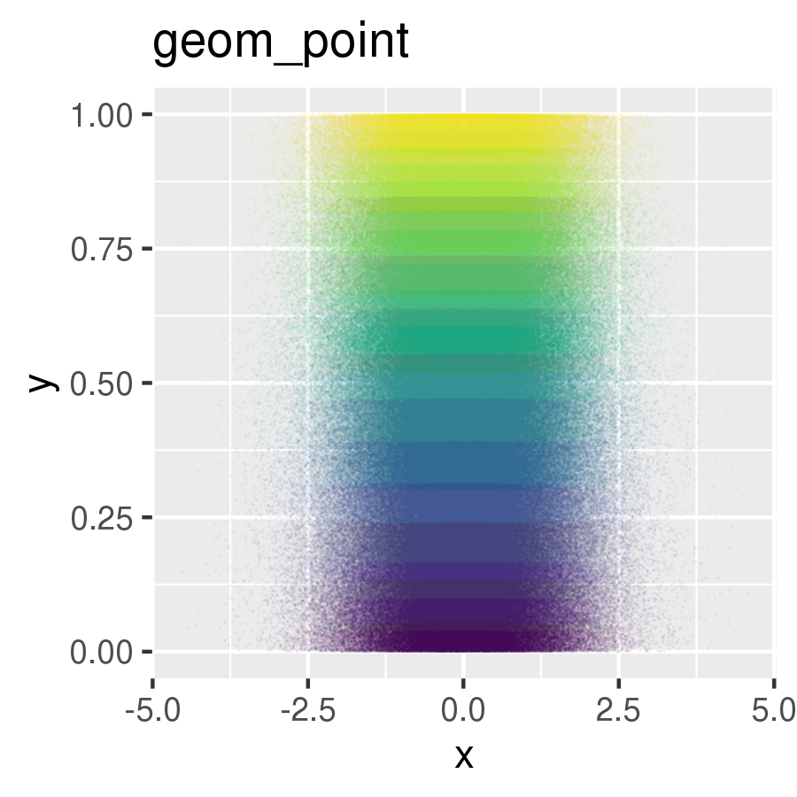
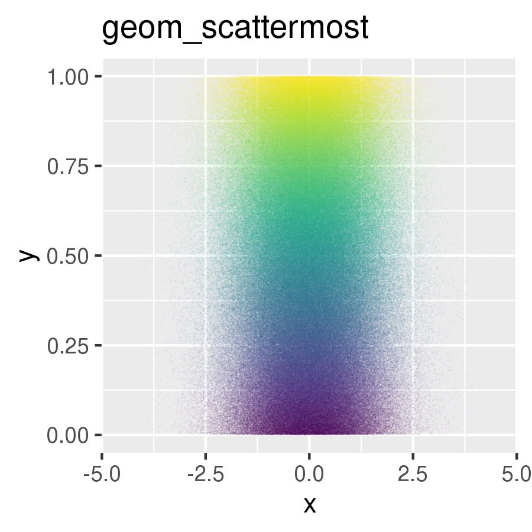

# scattermore

Scatterplots with more datapoints. If you want to plot bazillions of points without much waiting, use this.

## Installation

```r
devtools::install_github('exaexa/scattermore')
```

## Quick How-To

Function `scattermoreplot` is meant to behave roughly like the standard `plot`:
```r
library(scattermore)
scattermoreplot(rnorm(1e7),
                rnorm(1e7),
		col=heat.colors(1e7, alpha=.1),
		main='Scattermore demo')
```

If you use `ggplot2`, you can use `geom_scattermore` instead of `geom_point` to rasterize the graphics (e.g. to reduce PDF size):

```r
ggplot(....) + geom_scattermore()
```

(Note that the processing of data in ggplot is usually too slow itself; use `geom_scattermost` to dodge that.)

## Advanced usage

Function `scattermore` only creates the raster graphics for the plots; this can be plotted out afterwards (or processed in any other weird ways). Let's try a manual benchmark:

```r
# create 10 million 2D datapoints
data <- cbind(rnorm(1e7),rnorm(1e7))

# prepare empty plot
par(mar=rep(0,4))

# plot the datapoints and see how long it takes
system.time(plot(scattermore(data, rgba=c(64,128,192,10), xlim=c(-3,3), ylim=c(-3,3))))

   user  system elapsed 
  0.413   0.044   0.461 
```

You should immediately see _quite a bit_ of tiny points:


Now, how fast would the standard `plot()` do?

```r
# compare with the usual plot function on x11/cairo
system.time(plot(data, pch='.', xlim=c(-3,3), ylim=c(-3,3), col=rgb(0.25,0.5,0.75,0.04)))

   user  system elapsed 
  9.752   0.023   9.794 
```

This way, 0.46 seconds of `scattermore` means a nice ~20x speedup over `plot` on my laptop. Moreover, if you use different plotting setups (basically any non-Cairo, say windows- or quartz-based `grDevices` backends), you will very possibly see much greater speedups. Cairo is itself sometimes more than 10x faster than the other backends. That's 200x faster in total.

## How does it work

1. Points and colors get converted to vectors and passed to C
2. C code rasterizes the whole thing to a prepared bitmap. This is already quite fast, but some low-level optimization can probably speed it up several more times. Volunteers/pull requests welcome. (Is there a way to push a raw `uint8_t` array into C from R?)
3. The resulting array gets converted to R raster using `as.raster`, which can get plotted. (Fun fact: When plotting less than roughly 1 million points, most computational time is spent only by this conversion!)

## How fast is it

Let us measure the same example as above, with points limited to different sizes (i.e. in the first case, scattermore receives `data[1:1e4,]`):

```
points  .  average time (s)
--------+------------------
1e4     .  0.037
3e4     .  0.039
1e5     .  0.042
3e5     .  0.051
1e6     .  0.076     -- ~50% of the time is R raster conversion overhead
3e6     .  0.170     -- caches start to overflow here
1e7     .  0.460
```

(Multicolor plotting is slightly slower (usually 2x), because the reading and transporting of the relatively large color matrix eats quite a lot of cache.)

## How nice it is

Custom rasterization gives a bit of extra features. These are the two most obvious:

1. The gazillions of points are present as a raster, even in vector output. That might be a problem sometimes (remember to use sufficient raster size to get the desired DPI!), but makes vector output smaller and much more easily processed by other tools. (Remember the huge PDFs with scatterplots that take a minute to load?)
2. The rasterization is not required to work in limited memory as in usual plotting libraries, which we use to gain a bit of extra precision in color mixing. This is most visible when plotting a ton of low-alpha points where the usual blending methods produce ugly rounding artifacts.

```r
# data
d <- cbind(rnorm(1e6),runif(1e6))

# first plot (geom_point)
ggsave('point.png', units='in', width=3, height=3,
  ggplot(data.frame(x=d[,1],y=d[,2])) +
  geom_point(shape='.', alpha=.05, aes(x,y,color=y)) +
  scale_color_viridis_c(guide=F) +
  ggtitle("geom_point"))

# second plot (geom_scattermost)
ggsave('scattermore.png', units='in', width=3, height=3,
  ggplot() +
  geom_scattermost(
    d,
    col=viridisLite::viridis(100, alpha=0.05)[1+99*d[,2]],
    pointsize=1,
    pixels=c(700,700)) +
  ggtitle("geom_scattermost"))
```



